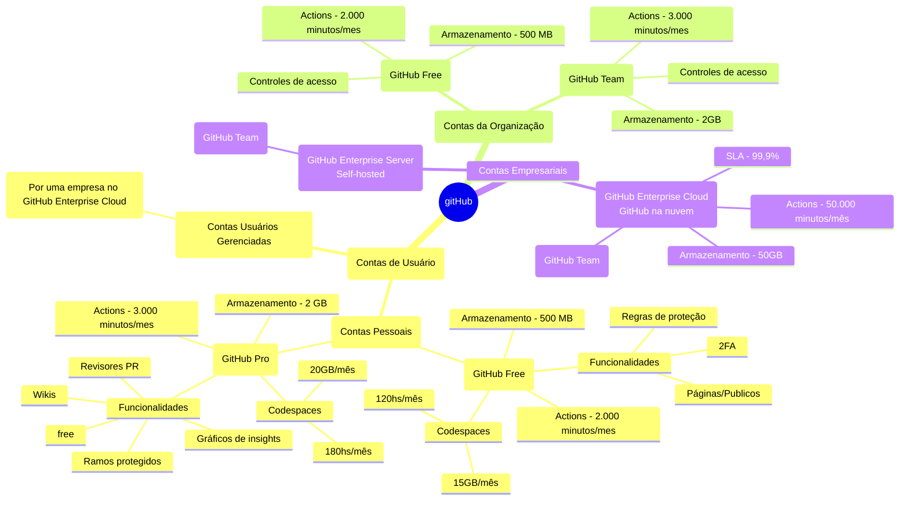

# Visão do Horacio

```mermaid
mindmap
  root((gitHub))
    (Contas de Usuário)
      (Contas Pessoais)
         (GitHub Free)
            Actions - 2.000 minutos/mes
            Armazenamento - 500 MB
            Codespaces 
               120hs/mês
               15GB/mês
            Funcionalidades
               Regras de proteção
               2FA
               Páginas/Publicos
         (GitHub Pro)
            Actions - 3.000 minutos/mes
            Armazenamento - 2 GB
            Codespaces
               180hs/mês
               20GB/mês
            Funcionalidades
              free
              Wikis
              Gráficos de insights
              Revisores PR
              Ramos protegidos            
      (Contas Usuários Gerenciadas)
         (Por uma empresa no GitHub Enterprise Cloud)
    (Contas da Organização)
        (GitHub Free)
             Controles de acesso
             Actions - 2.000 minutos/mes
             Armazenamento - 500 MB
        (GitHub Team)
             Controles de acesso
             Actions - 3.000 minutos/mes
             Armazenamento - 2GB
    Contas Empresariais
        (GitHub Enterprise Cloud</br>GitHub na nuvem)
            (GitHub Team)
            Actions - 50.000 minutos/mês
            Armazenamento - 50GB
            SLA - 99,9%            
        (GitHub Enterprise Server</br>Self-hosted)
            (GitHub Team)        
```
